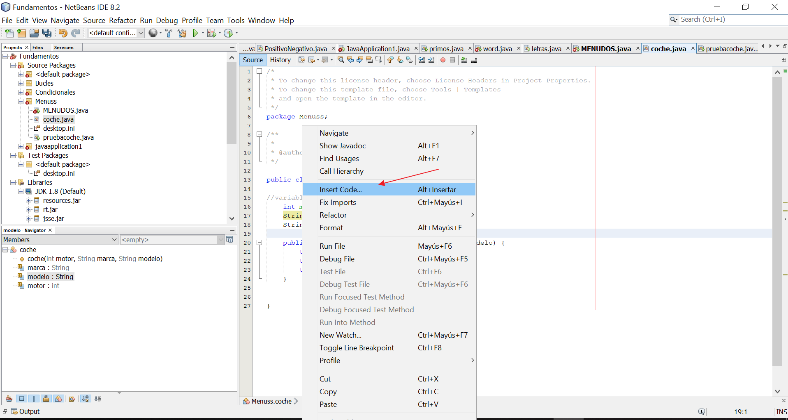
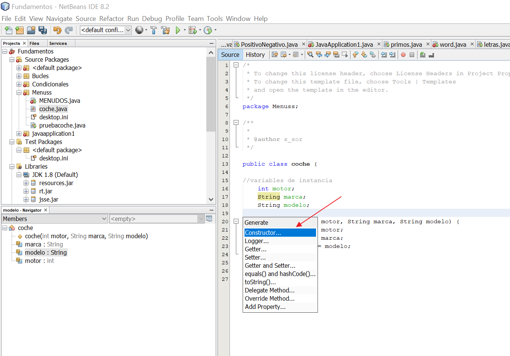
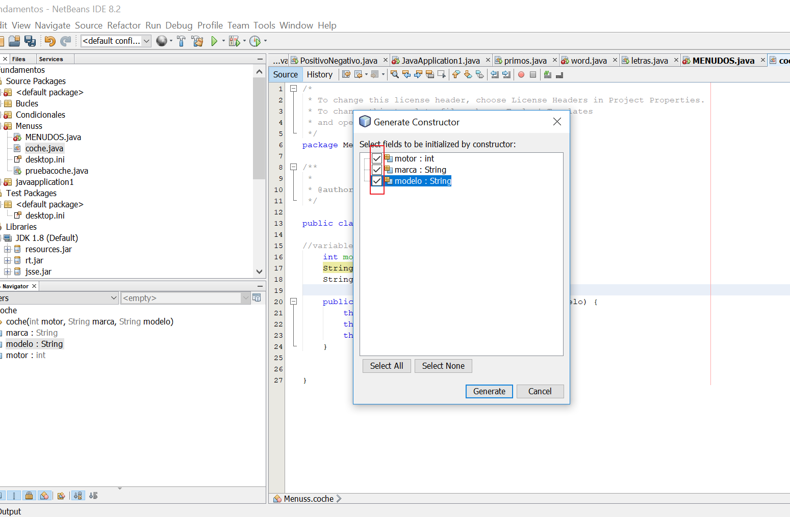
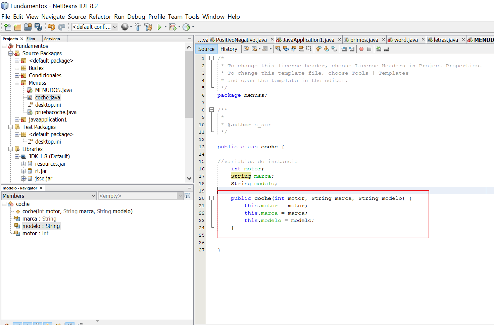
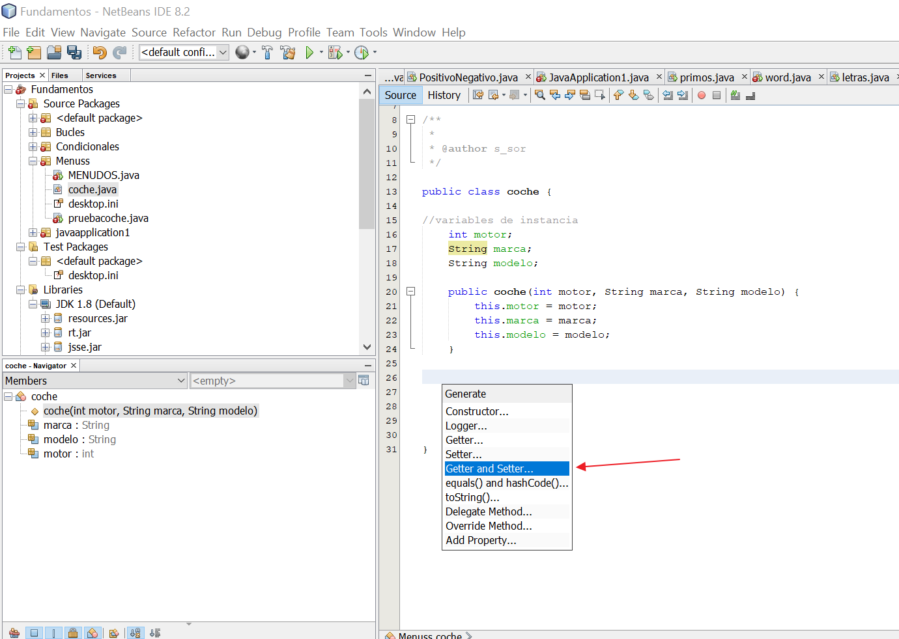

# 3. Módulo 3. POO, Conceptos básicos II

<!-- TOC -->
- [3. Módulo 3. POO, Conceptos básicos II](#3-m%C3%B3dulo-3-poo-conceptos-b%C3%A1sicos-ii)
  - [3.1 Instancias y métodos constructores](#31-instancias-y-m%C3%A9todos-constructores)
    - [Creación del constructor de objetos](#creaci%C3%B3n-del-constructor-de-objetos)
  - [3.2 Interfaces](#32-interfaces)
  - [3.3 Polimorfismo](#33-polimorfismo)
  - [3.4 Herencia](#34-herencia)
  - [3.5 Encapsulación. Niveles de acceso](#35-encapsulaci%C3%B3n-niveles-de-acceso)
  - [3.6 Modificador de acceso static](#36-modificador-de-acceso-static)
  - [3.7 Buenas prácticas vs malos olores](#37-buenas-pr%C3%A1cticas-vs-malos-olores)

## 3.1 Instancias y métodos constructores

Un **metodo** es un conjunto de instrucciones que solo se van a ejecutar cuando yo las llame.

Si un metodo no devuelve nada se pone `void`. Si no tiene que llevar un return. En vez de void se tiene que poner el tipo de dato que va a devolver, como por ejemplo `int`, `String`)

```java
public static void crearCoche(){
```

Implementacion del metodo
Se introducen parametros formales

```java
    public int suma (int x, int y)
    {
        return(x+y);

    }
```

### Creación del constructor de objetos






Creación de  los Gettle y Settle para consultar o asignar nuevos valores a los objetos


## 3.2 Interfaces

## 3.3 Polimorfismo

## 3.4 Herencia

## 3.5 Encapsulación. Niveles de acceso

## 3.6 Modificador de acceso static

## 3.7 Buenas prácticas vs malos olores